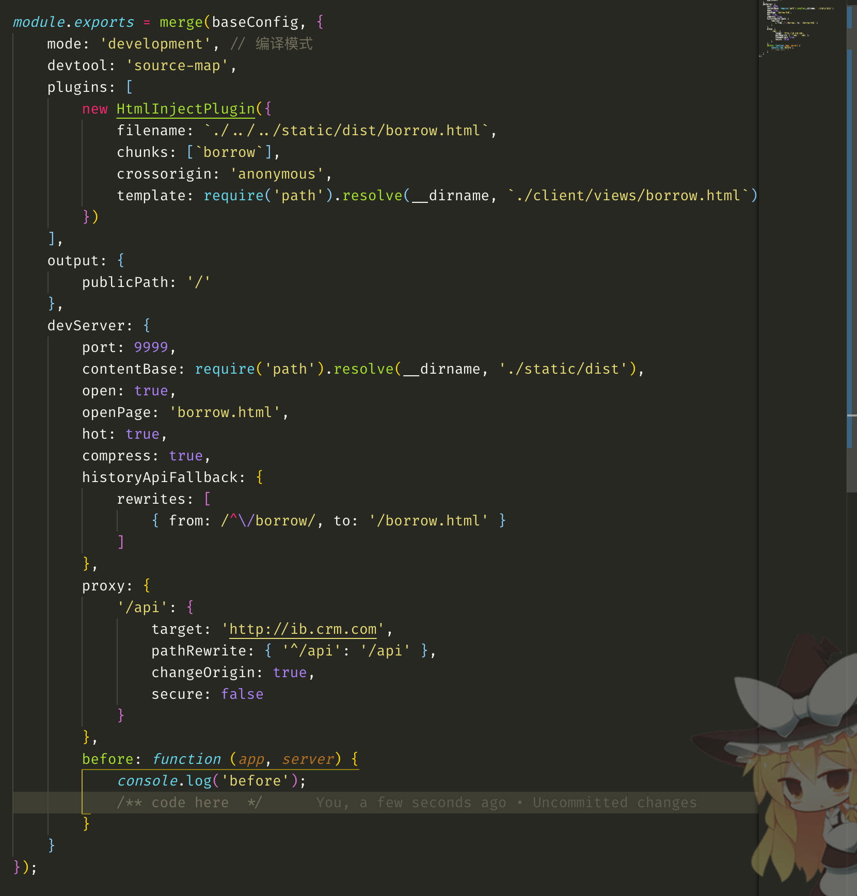
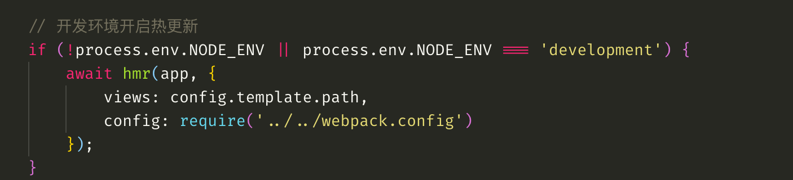

# node-hmr

旨在开启HMR（hot module replacement--模块热替换）功能。提供类似于webpack-dev-server(WDS)的开发体验

# 原理

百度或者谷歌

# 注意事项

如果开启这个中间件，所有文件会同webpack-dev-server一样打包到内存，只适合本地开发环境使用。

# 用法

```js
    // 开发环境开启热更新
    if (!process.env.NODE_ENV || process.env.NODE_ENV === 'development') {
        await require('node-hmr')(app, {
            views: require('path').resolve(__dirname, '../views'), // 类似于koa-views，指定模板文件目录
            config: require('../../webpack.config'), // your webpack config
            hotClient: { //webpack-hot-client 参数
                reload: false,
                hmr: true
            },
            devMiddleware: {}, // webpack-dev-middleware 中间件参数
            // when compile done, you can get hello string
            compileDone: (middleware) => {
                console.log('hello');
            }
        });
    }
```

# 实现

如果是简单的纯前端项目直接使用WDS即可实现热更新，如果是类似公司框架的项目则使用WDS需要更改较多的配置。可能的更改点如下
1. 而且由于公司本来使用koa-views来处理html模板的，所以如果强行要使用WDS来实现热更新那么还要自己处理模板文件（猜想在before和after钩子函数中可以实现）
2. 公司项目基本都要登录，所以还可能要处理登录相关事项

以上问题没有深入研究。如果你想要使用WDS来开发，那么你的配置文件可能长这样：



我们知道本质上WDS也是通过webpack-dev-middleware(WDM)和webpack-hot-middleware(WHM)这两个中间件来启动了一个express服务器从而实现热更新功能。所以我们也可以类似的集成这两个中间件到我们的项目中。但是WDM和WHM都是express中间件，所以考虑到我们使用的是koa2框架，所以找了一个基本已经封装好了的中间件[koa-webpack](https://github.com/shellscape/koa-webpack).该中间件使用的是WDM和webpack-hot-client(WHC)而非WHM。WHD和WHC的区别如下：

1. WHM 是express 中间件， WHC不是中间件
2. WHM 支持比较老的IE浏览器，WHC不支持。因为WHC使用Websocket进行实时通信，而WHM使用EventSource.
3. WHC对代码的侵入性不强，你基本不用更改你的配置和代码就可享受到其带来的hmr能力
   
koa-wepback源码也十分简单,有兴趣可以看看。

我们在koa-webpack的基础上针对我们公司的node项目做了一点进一步的封装，将其中需要我们自己处理的模板渲染过程进行封装，对ctx.render方法进行重写，使其使用内存中存在的文件而非磁盘文件。

使用该中间件你基本不用更改你的webpack配置，只需简单的在对应的环境（开发环境）引入该中间件即可:



<!-- 缺点：暂不支持使用`@futu/render`组件的项目，因为重写的render方法并没有兼容去common.futu5.com拉取模板的功能，如果使用`@futu/render`的项目使用本组件会导致公共部分无法渲染的问题。 -->

# API

由于该中间件事对`koa-webpack`的封装，所以基本配置和`koa-webpack`一致。你可以从[这里](https://github.com/shellscape/koa-webpack)找到koaWebpack的配置。以下是本中间件特有的配置：

### views

Type: `string`

由于本中间件本质是封装了从内存中读取模板数据的功能，所以你可以通过设置该参数来查找。该参数本质是render方法的前置路径。

Example:
```js
// middleware.js
await hmr(app, {
   views: require('path').resolve(__dirname, '../views'), // 类似于koa-views，指定模板文件目录
   config: require('../../webpack.config'), // your webpack config
});

// controller.js
async function (ctx) {
    await ctx.render('index', {
        env: 'develop',
        someRenderData: ''
    });
};
```

如示例所示，如果你设置view选项，则实际渲染模板的路径为`require('path').resolve(__dirname, '../views', 'index.html')`

### compileDone

Type: `function`

webpack编译完成时进行的回调。你可以再这里做一下自定义动作。回调函数参数`middleware`是koaWebpack实例。